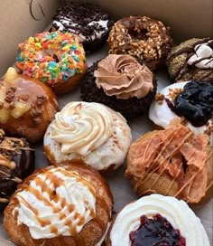

LINK WEB : 

# WEB-MENU

# F&F Cafe's and Game Board

## Deskripsi Proyek
F&F Cafe's and Game Board adalah sebuah halaman web statis yang menampilkan menu makanan dan permainan papan di kafe F&F. Website ini dirancang menggunakan **HTML dan CSS** dengan tata letak responsif yang rapi dan mudah diakses.

## Fitur Utama
- **Header:** Berisi nama kafe dan slogan.
- **Navigasi:** Menu utama yang menghubungkan ke berbagai halaman seperti Beranda, Daftar Makanan, Game Board, Tentang, dan Kontak.
- **Konten Utama:**
  - **Menu Makanan:** Menampilkan daftar makanan utama beserta gambar dan deskripsinya.
  - **Sidebar:** Menampilkan daftar snack populer dan informasi kontak.
- **Footer:** Bagian bawah halaman yang mencakup hak cipta dan informasi tambahan.


## Cara Menjalankan Proyek
1. Clone repository ini ke dalam komputer Anda:
   ```sh
   git clone https://github.com/username/FF-Cafe.git
   ```
2. Buka file **index.html** di browser untuk melihat tampilan halaman.

## Teknologi yang Digunakan
- **HTML**: Struktur dasar halaman web
- **CSS**: Styling dan tata letak

## Penjelasan Kode Inti
Berikut adalah beberapa bagian utama dari kode:

### 1. Struktur Dasar HTML
```html
<!DOCTYPE html>
<html lang="id">
<head>
    <meta charset="UTF-8">
    <meta name="viewport" content="width=device-width, initial-scale=1.0">
    <title>F&F Cafe's and Games</title>
</head>
<body>
    <div class="container">
        <header>
            <h1>F&F Cafe's and Game Board</h1>
            <p>Menikmati Makanan Dan Bermain Bersama</p>
        </header>
```
Kode ini mendefinisikan struktur dasar HTML dengan elemen `head` untuk metadata dan `body` untuk konten utama.

### 2. Navigasi
```html
<nav>
    <a href="#">Beranda</a>
    <a href="#">Daftar Makanan</a>
    <a href="#">Game Board</a>
    <a href="#">Tentang</a>
    <a href="#">Kontak</a>
</nav>
```
Navigasi ini memungkinkan pengguna berpindah antar halaman dengan tautan sederhana.

### 3. Menu Makanan
```html
<div class="menu-item">
    
    <div>
        <h3>Ayam Katsu</h3>
        <p>Chicken katsu adalah ayam goreng berlapis tepung roti khas Jepang.</p>
    </div>
</div>
```
Setiap makanan memiliki gambar, nama, dan deskripsi yang dirancang dalam struktur yang rapi.

### 4. Sidebar
```html
<aside class="sidebar">
    <h3>Snack Populer</h3>
    <ul>
        <li> Waffle</li>
        <li> Sweet Donut</li>
    </ul>
</aside>
```
Sidebar ini menampilkan snack populer dengan gambar kecil untuk tampilan yang lebih menarik.

### 5. Footer
```html
<footer>
    <p>&copy; 2025 F&F Cafe's and Game Board. Semua Hak Dilindungi.</p>
</footer>
```
Bagian ini memastikan bahwa hak cipta tampil di bagian bawah halaman dengan lebar penuh.
